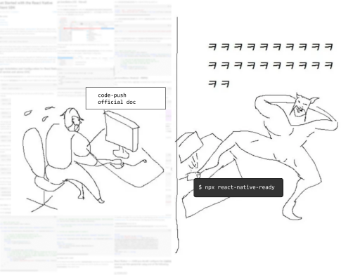

# code-push-ready



commands automatically update file settings for code push in your react-native project

## Guide

1. install react-native-codepush-autoset

   ```
   npm i react-native-codepush-autoset
   ```

2. go to your react-native project

   ```
   cd YOUR_PROJECT/
   ```

3. run command below
   ```
   react-native-codepush-autoset run
   ```

Done!

## To-do list

- [ ] ios
  - [ ] appcenter
  - [ ] codepush
- [ ] android
  - [ ] appcetner
  - [ ] codepush
    - [ ] considering in case of code exist
    - [x] build.gradle
    - [x] settings.gradle
    - [x] MainApplication.java
